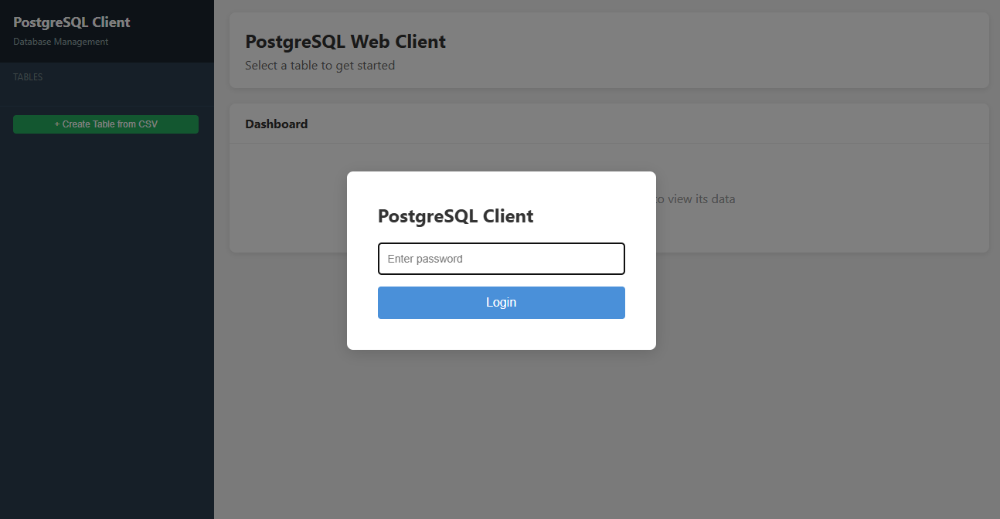
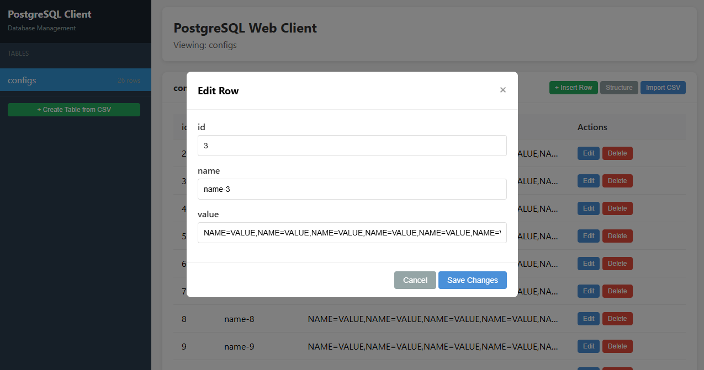
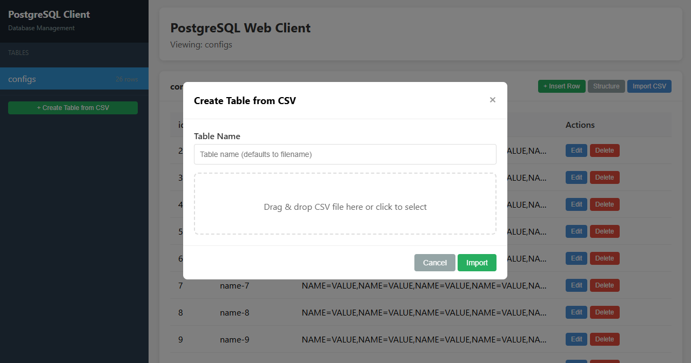

# PostgreSQL Client

A modular PostgreSQL command-line and web-based client written in Go with YAML configuration support.


*Web interface login screen with password authentication*

## Features

- **Interactive and Non-Interactive Modes**
  - Interactive command-line interface with prompt
  - SQL query execution and script file running
  - Web-based management interface (`-web` flag)
  - Non-interactive batch import (`-i` flag)

- **Data Operations**
  - SQL query execution (SELECT, INSERT, UPDATE, DELETE, etc.)
  - JSON and CSV export
  - Table content pagination with navigation (first/prev/next/last, go to page/row)
  - Row viewing, editing, and deletion
  - Add new rows with manual input or copy from existing row


*Edit row functionality with form-based input*

- **Import Operations** (`\i` command)
  - DDL script import with duplicate table detection
  - CSV import with auto-create table & compare-import (skip identical rows)
  - SQL script file execution
  - File dialog from configurable directories (ddl/ csv/ sql/)
  - Pre-import validation for SQL syntax and CSV data integrity
  - Batch insert with per-row fallback on error


*Create table from CSV with drag-and-drop support*

- **Interactive Selection**
  - Database selection with arrow keys
  - Table selection with arrow keys
  - Table operation menu (view structure, view content)
  - Main menu integrating all available actions

- **Web Management Interface**
  - Password-based authentication with auto-generated credentials
  - Table listing with row counts
  - Paginated table data browsing with column sorting
  - Table structure inspection (column name, type, nullable, default)
  - Row insert, edit, and delete operations
  - CSV import with auto-create table support

- **Configuration Management**
  - YAML configuration file support (`config.yaml` or `config.yml`)
  - Environment variable support
  - Command-line argument overrides
  - Structured logging to file

## Project Structure

```
.
├── internal/              # Internal packages
│   ├── cli/               # CLI interactive components
│   │   ├── interface.go   # Survey-based selectors (DB, table, menu, row, pagination)
│   │   └── interface_test.go
│   ├── commons/           # Shared utilities, logging, error types
│   │   ├── commons.go     # Logger, error types, formatters, utility functions
│   │   └── commons_test.go
│   ├── config/            # Configuration management
│   │   ├── config.go      # Config loading from YAML/env, save support
│   │   └── config_test.go
│   ├── database/          # Database operations
│   │   ├── database.go    # Database connection and query execution
│   │   ├── database_test.go
│   │   ├── query.go       # Query helpers (GetAllTables, DescribeTable, CRUD)
│   │   └── query_test.go
│   ├── formatter/         # Output formatting (table, JSON, CSV)
│   │   ├── formatter.go
│   │   └── formatter_test.go
│   ├── importer/          # Data import (DDL, CSV, SQL script)
│   │   ├── importer.go    # Import core logic with batch insert
│   │   └── validator.go   # SQL/CSV validation and statement splitting
│   └── web/               # Web management interface
│       ├── server.go      # HTTP server with auth, REST API endpoints
│       └── template.go    # Embedded HTML/CSS/JS single-page application
├── main.go                # Main entry point
├── config.example.yaml    # Example configuration
├── build.sh               # Linux/macOS cross-compilation script
├── build.ps1              # Windows cross-compilation script
└── go.mod                 # Go module definition
```

## Configuration

### YAML Configuration File

Create a `config.yaml` file (or use `-c` flag to specify a path). The client also looks for `config.yml` automatically:

```yaml
host: localhost
port: 5432
user: postgres
password: your_password
database: postgres
ssl_mode: disable

# Import directories for \i import menu
import:
  ddl: ddl        # DDL scripts directory
  csv: csv        # CSV data files directory
  sql: sql        # SQL script files directory
```

### Environment Variables

Configure connection information using the following environment variables:

- `PGHOST` - Database host (default: localhost)
- `PGPORT` - Database port (default: 5432)
- `PGUSER` - Database user (default: postgres)
- `PGPASSWORD` - Database password
- `PGDATABASE` - Database name (default: postgres)

### Command-Line Arguments

Command-line arguments override values from config files and environment variables:

```
-c, --config      Path to configuration file
-h, --host        Database host
-p, --port        Database port (default: 5432)
-U, --user        Database user
-W, --password    Database password
-d, --database    Database name
-i, --import      Import file or directory path (non-interactive)
-web              Enable web management interface
-web-port         Web server port (default: 8080)
```

## Usage

### Interactive Mode

```bash
./postgresql-client
```

Enter interactive command-line mode with the following commands:

| Command | Description |
|---------|-------------|
| `\q`, `quit`, `exit` | Quit the client |
| `\h`, `\?`, `help` | Show help message |
| `\m`, `\menu` | Open main menu (all available actions) |
| `\i`, `\import` | Open import menu (DDL, CSV, SQL script import) |
| `\l`, `\list` | List all databases |
| `\dt`, `\d tables` | List all tables |
| `\d`, `\D` | Interactive table structure description |
| `\s`, `\select-db` | Select database with arrow keys |
| `\t`, `\select-table` | Select table (view structure/content) |
| `\c`, `\C` | Select and connect to database |

### Non-Interactive Mode

```bash
# Execute SQL command
./postgresql-client "SELECT * FROM table"

# Execute SQL command (explicit flag)
./postgresql-client -c "SELECT * FROM table"

# Run SQL from file
./postgresql-client -f script.sql

# Export as JSON
./postgresql-client --json "SELECT * FROM table"

# Export as CSV
./postgresql-client --csv "SELECT * FROM table"

# Import from file (auto-detect by extension)
./postgresql-client -i data.csv
./postgresql-client -i schema.sql
./postgresql-client -i ./import-directory/

# Import all files from a directory
./postgresql-client -i ./data/
```

### Web Management Interface

```bash
# Start web server on default port 8080
./postgresql-client -web

# Start web server on custom port
./postgresql-client -web -web-port 3000
```

The web interface provides:
- **Authentication**: Auto-generated password displayed in terminal
- **Table Browsing**: Paginated data with column sorting
- **CRUD Operations**: Insert, edit, and delete rows via forms
- **CSV Import**: Drag-and-drop file upload with auto-create table
- **Structure View**: Inspect column definitions

## Table Operations

### View Table Structure
```sql
\d table_name
```
Displays column names, data types, nullability, and default values.

### Browse Table Content with Pagination
Use `\t` or `\select-table` command to select a table for:
- Navigate through paginated results (20 rows per page)
- Jump to specific page or row number
- View row details, edit, or delete
- Add new rows (manual input or copy from existing row)

### Main Menu Actions
Enter `\m` or `\menu` to open the main menu with options:
1. List all databases
2. List all tables
3. Select and describe table structure
4. Select and show table content
5. Select and connect to database
6. Execute custom SQL query
7. Import data
8. Show help
9. Quit

## Import Operations

### DDL Import
- Validates SQL syntax before execution
- Checks for duplicate tables and prompts for skip/continue
- Supports `CREATE TABLE`, `ALTER TABLE`, and other DDL statements

### CSV Import
- Auto-creates table with TEXT columns if table doesn't exist
- Compare import mode: skips rows that already exist (all columns match)
- Batch insert (500 rows per batch) with per-row fallback on error
- Validates headers (no empty/duplicate) and column count consistency

### SQL Script Import
- Executes multiple SQL statements from a single file
- Validates syntax and splits statements intelligently (handles quotes, parentheses)
- Supports scripts without trailing semicolons

## Building

### Using Build Scripts

Build scripts output to the `dist/` directory and support cross-compilation for multiple platforms.

**Linux/macOS:**
```bash
./build.sh

# Build for a specific target
./build.sh Linux_x86_64
./build.sh macOS_ARM64
```

**Windows (PowerShell):**
```powershell
.\build.ps1

# Build for a specific target
.\build.ps1 Windows_x86_64
.\build.ps1 Linux_ARM64
```

### Manual Build

```bash
# Default build
go build -o postgresql-client .

# Cross-compile for Linux
CGO_ENABLED=0 GOOS=linux GOARCH=amd64 go build -o postgresql-client-linux .

# Cross-compile for Windows
CGO_ENABLED=0 GOOS=windows GOARCH=amd64 go build -o postgresql-client.exe .
```

## Requirements

- Go 1.25+
- PostgreSQL 9.x+ server
- Network connectivity (for database connections)

## Dependencies

| Component | Technology |
|-----------|------------|
| Database Driver | pgx/v5 |
| YAML Parsing | yaml.v3 |
| Interactive UI | survey/v2 |

## License

MIT